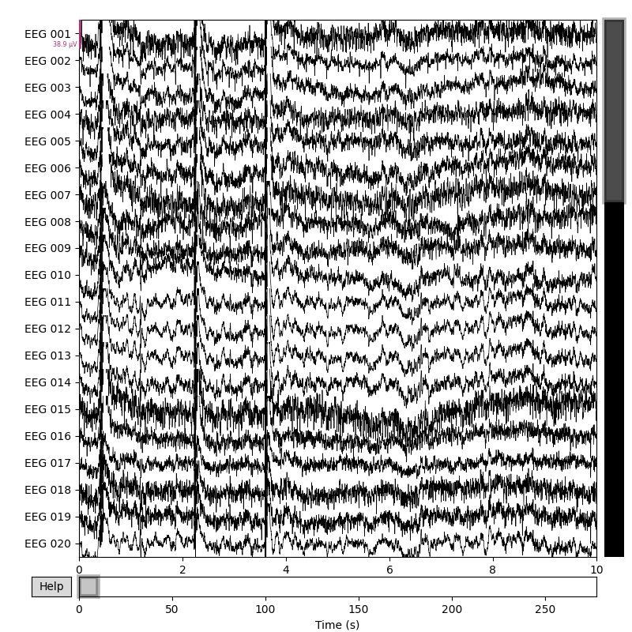

# EEG Cognition Project (Basic EEG Data Analysis and Visualization)
This project aims to load, process, and visualize fundamental EEG (Electroencephalography) data using the MNE-Python library. It serves as an introductory example for those interested in cognitive science and neuroscience, providing a simple case for working with EEG signals.
## Project Objective

* To load a sample EEG dataset using the MNE-Python library.
* To display basic information about the loaded raw EEG data.
* To filter the data by selecting only the EEG channels.
* To visualize the raw EEG signals.
## Technologies Used

* **Python 3.x:** The main programming language for the project.
* **MNE-Python:** A leading open-source Python library for EEG/MEG data analysis.
* **Matplotlib:** A Python library used for data visualization.
* **Git:** Version control system.
* **GitHub:** Platform for hosting the project code.
## Output Example
